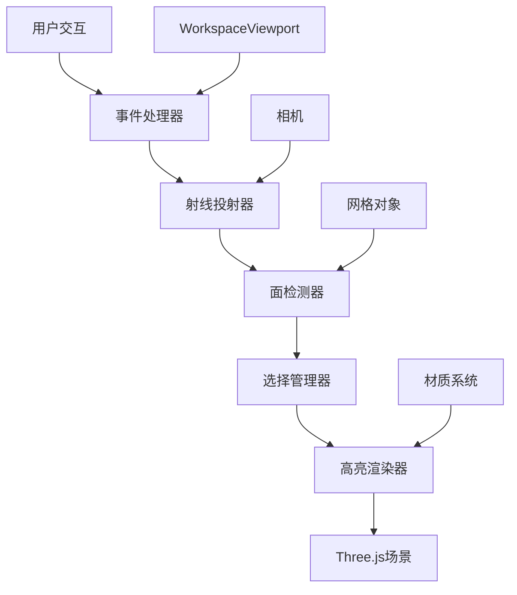

# 设计文档

## 概述

本设计文档描述了在基于Three.js的3D网格编辑器中实现面级拾取和高亮功能的技术方案。该系统将使用射线投射技术进行面检测，并通过材质操作实现视觉高亮效果。

## 架构

### 系统架构图



### 核心组件

1. **FacePicker**: 主要的面拾取控制器
2. **RaycastManager**: 射线投射管理器
3. **SelectionManager**: 选择状态管理器
4. **HighlightRenderer**: 高亮渲染管理器
5. **EventHandler**: 鼠标事件处理器

## 组件和接口

### FacePicker 类

```javascript
class FacePicker {
  constructor(scene, camera, renderer, domElement)
  
  // 公共方法
  enable()                    // 启用面拾取
  disable()                   // 禁用面拾取
  selectFace(face, additive)  // 选择面
  clearSelection()            // 清除选择
  getSelectedFaces()          // 获取选中的面
  
  // 事件
  on('faceSelected', callback)
  on('faceDeselected', callback)
  on('selectionCleared', callback)
}
```

### RaycastManager 类

```javascript
class RaycastManager {
  constructor(camera)
  
  // 射线投射检测
  intersectFaces(mousePosition, meshes)
  
  // 返回格式
  {
    face: Face,           // Three.js Face对象
    faceIndex: number,    // 面索引
    mesh: Mesh,          // 所属网格
    point: Vector3,      // 交点坐标
    distance: number     // 距离相机的距离
  }
}
```

### SelectionManager 类

```javascript
class SelectionManager {
  constructor()
  
  // 选择管理
  addFace(faceInfo)
  removeFace(faceInfo)
  clearAll()
  contains(faceInfo)
  getAll()
  
  // 选择模式
  setSingleSelectMode()
  setMultiSelectMode()
}
```

### HighlightRenderer 类

```javascript
class HighlightRenderer {
  constructor(scene)
  
  // 高亮管理
  highlightFace(mesh, faceIndex, color)
  removeHighlight(mesh, faceIndex)
  clearAllHighlights()
  
  // 悬停效果
  showHoverEffect(mesh, faceIndex)
  hideHoverEffect()
}
```

## 数据模型

### FaceInfo 数据结构

```javascript
{
  mesh: THREE.Mesh,        // 网格对象
  faceIndex: number,       // 面索引
  face: THREE.Face3,       // 面对象（如果可用）
  normal: THREE.Vector3,   // 面法向量
  center: THREE.Vector3,   // 面中心点
  vertices: [             // 面顶点
    THREE.Vector3,
    THREE.Vector3,
    THREE.Vector3
  ]
}
```

### 选择状态

```javascript
{
  selectedFaces: Map<string, FaceInfo>,  // 选中的面
  hoverFace: FaceInfo | null,           // 悬停的面
  selectionMode: 'single' | 'multi'     // 选择模式
}
```

## 技术实现方案

### 1. 射线投射实现

使用Three.js的Raycaster进行面级检测：

```javascript
// 创建射线投射器
const raycaster = new THREE.Raycaster();

// 设置鼠标位置
const mouse = new THREE.Vector2();
mouse.x = (event.clientX / window.innerWidth) * 2 - 1;
mouse.y = -(event.clientY / window.innerHeight) * 2 + 1;

// 从相机发射射线
raycaster.setFromCamera(mouse, camera);

// 检测交点
const intersects = raycaster.intersectObjects(meshes, true);
```

### 2. 面高亮实现方案

#### 方案A: 材质克隆法（推荐）

为每个网格创建高亮材质副本：

```javascript
// 创建高亮材质
const highlightMaterial = originalMaterial.clone();
highlightMaterial.color.setHex(0xff6b35); // 橙色高亮

// 面级高亮通过几何体分组实现
const geometry = mesh.geometry;
const faces = geometry.faces;

// 为选中的面创建单独的几何体
const highlightGeometry = new THREE.Geometry();
// 复制选中面的顶点和面信息
```

#### 方案B: 着色器材质法

使用自定义着色器实现面级高亮：

```javascript
const vertexShader = `
  attribute float faceIndex;
  attribute float isSelected;
  varying float vSelected;
  
  void main() {
    vSelected = isSelected;
    gl_Position = projectionMatrix * modelViewMatrix * vec4(position, 1.0);
  }
`;

const fragmentShader = `
  varying float vSelected;
  uniform vec3 baseColor;
  uniform vec3 highlightColor;
  
  void main() {
    vec3 color = mix(baseColor, highlightColor, vSelected);
    gl_FragColor = vec4(color, 1.0);
  }
`;
```

### 3. 性能优化策略

#### 几何体预处理

```javascript
// 预计算面信息以提高拾取性能
class FacePreprocessor {
  static preprocessMesh(mesh) {
    const geometry = mesh.geometry;
    const faceData = [];
    
    // 预计算每个面的中心点和法向量
    for (let i = 0; i < geometry.faces.length; i++) {
      const face = geometry.faces[i];
      const center = this.calculateFaceCenter(geometry, face);
      const normal = face.normal.clone();
      
      faceData.push({
        index: i,
        center: center,
        normal: normal,
        area: this.calculateFaceArea(geometry, face)
      });
    }
    
    mesh.userData.faceData = faceData;
    return faceData;
  }
}
```

#### 空间分割优化

```javascript
// 使用八叉树或BVH加速面查询
class SpatialIndex {
  constructor(meshes) {
    this.octree = new THREE.Octree();
    this.buildIndex(meshes);
  }
  
  queryFaces(ray) {
    // 快速查询可能相交的面
    return this.octree.intersectRay(ray);
  }
}
```

## 错误处理

### 异常情况处理

1. **无效几何体**: 检查网格是否包含有效的面数据
2. **射线投射失败**: 处理射线与场景无交点的情况
3. **材质不兼容**: 确保高亮材质与原始材质兼容
4. **性能降级**: 在复杂场景中自动降低检测精度

```javascript
class ErrorHandler {
  static validateMesh(mesh) {
    if (!mesh.geometry) {
      throw new Error('网格缺少几何体数据');
    }
    
    if (!mesh.geometry.faces || mesh.geometry.faces.length === 0) {
      console.warn('网格不包含面数据，将跳过面拾取');
      return false;
    }
    
    return true;
  }
  
  static handleRaycastError(error) {
    console.error('射线投射失败:', error);
    // 降级到对象级拾取
    return this.fallbackToObjectPicking();
  }
}
```

## 测试策略

### 单元测试

- **射线投射准确性**: 验证射线投射能正确识别面
- **选择状态管理**: 测试单选、多选、清除等操作
- **高亮渲染**: 验证高亮效果的正确应用和移除
- **性能基准**: 测试不同复杂度网格的响应时间

### 集成测试

- **与现有视口集成**: 确保不干扰相机控制
- **多网格场景**: 测试多个网格同时存在时的行为
- **材质兼容性**: 测试与不同材质类型的兼容性

### 用户体验测试

- **响应时间**: 验证50ms响应时间要求
- **视觉反馈**: 确认高亮效果的清晰度和对比度
- **交互流畅性**: 测试连续选择操作的流畅性

## 正确性属性

*属性是应该在系统的所有有效执行中保持为真的特征或行为——本质上是关于系统应该做什么的正式声明。属性作为人类可读规范和机器可验证正确性保证之间的桥梁。*

### 属性1: 面拾取识别准确性
*对于任何*网格和有效的点击位置，当射线投射检测到面时，系统应正确识别该面并将其标记为选中状态
**验证需求: 1.1, 1.2**

### 属性2: 选择管理一致性
*对于任何*面选择操作（单选、多选、取消选择），系统的选择状态应与用户的输入操作保持一致
**验证需求: 3.1, 3.2, 3.3**

### 属性3: 高亮状态同步
*对于任何*面选择状态变化，高亮显示应与选择状态保持同步，选中的面应被高亮，未选中的面应移除高亮
**验证需求: 2.2, 2.4**

### 属性4: 射线投射深度准确性
*对于任何*包含多个重叠面的场景，射线投射应始终选择距离相机最近的面
**验证需求: 1.5, 4.2**

### 属性5: 选择状态持久性
*对于任何*选择状态，在没有明确的用户交互（点击、键盘输入）的情况下，选择状态应保持不变
**验证需求: 3.5**

### 属性6: 响应时间性能
*对于任何*面拾取操作，系统应在50毫秒内完成响应
**验证需求: 4.1**

### 属性7: 事件系统完整性
*对于任何*面拾取事件（选择、取消选择、清除），系统应发出相应的事件通知，并提供准确的选择状态查询API
**验证需求: 5.3, 5.5**

### 属性8: 几何体兼容性
*对于任何*支持的几何体类型（BoxGeometry、STL模型等），面拾取功能应正常工作
**验证需求: 5.4**
### 属性基础测试配置

**双重测试方法**:
- **单元测试**: 验证特定示例、边缘情况和错误条件
- **属性测试**: 验证所有输入的通用属性
- 两者互补且都是全面覆盖所必需的

**属性测试配置**:
- 每个属性测试最少100次迭代（由于随机化）
- 每个属性测试必须引用其设计文档属性
- 标签格式: **Feature: mesh-face-picking, Property {number}: {property_text}**

**单元测试平衡**:
- 单元测试有助于特定示例和边缘情况
- 避免编写过多单元测试 - 基于属性的测试处理大量输入覆盖
- 单元测试应专注于:
  - 演示正确行为的特定示例
  - 组件之间的集成点
  - 边缘情况和错误条件
- 属性测试应专注于:
  - 适用于所有输入的通用属性
  - 通过随机化实现全面的输入覆盖