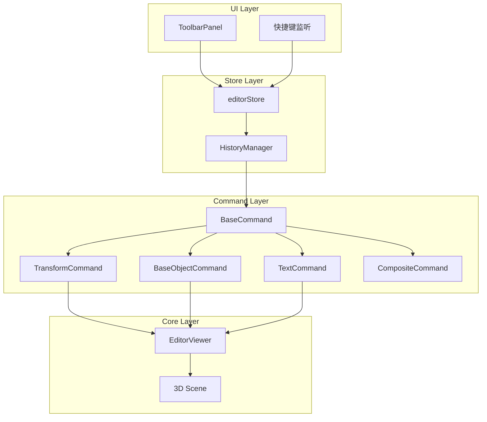

# Design Document: 撤销重做系统

## Overview

撤销重做系统采用命令模式（Command Pattern）实现，通过 `HistoryManager` 统一管理所有可撤销操作。每个操作被封装为一个 `Command` 对象，包含执行（execute）和撤销（undo）逻辑。系统支持同步和异步操作，并提供事务机制将多个操作合并为一个可撤销单元。

## Architecture



## Components and Interfaces

### 1. HistoryManager

核心历史记录管理器，维护撤销/重做栈。

```javascript
class HistoryManager {
  constructor(options = {}) {
    this.undoStack = []           // 撤销栈
    this.redoStack = []           // 重做栈
    this.maxSize = options.maxSize || 50
    this.isExecuting = false      // 防止递归
    this.transaction = null       // 当前事务
    this.asyncOperationInProgress = false
  }
  
  // 执行命令并记录
  execute(command) → Promise<void>
  
  // 撤销
  undo() → Promise<Command | null>
  
  // 重做
  redo() → Promise<Command | null>
  
  // 事务支持
  beginTransaction(name) → void
  commitTransaction() → void
  rollbackTransaction() → Promise<void>
  
  // 状态查询
  canUndo() → boolean
  canRedo() → boolean
  getUndoStackSize() → number
  getRedoStackSize() → number
  
  // 清理
  clear() → void
}
```

### 2. Command 基类

所有命令的抽象基类。

```javascript
class BaseCommand {
  constructor(type, description) {
    this.type = type              // 命令类型
    this.description = description // 描述（用于UI显示）
    this.timestamp = Date.now()
    this.isAsync = false          // 是否异步命令
  }
  
  // 执行命令
  async execute() → Promise<void>
  
  // 撤销命令
  async undo() → Promise<void>
  
  // 是否可以与另一个命令合并
  canMergeWith(other) → boolean
  
  // 合并命令
  mergeWith(other) → BaseCommand
}
```

### 3. TransformCommand

物体变换命令。

```javascript
class TransformCommand extends BaseCommand {
  constructor(object, transformType, beforeState, afterState) {
    super('TRANSFORM', `${transformType} 变换`)
    this.objectId = object.uuid
    this.objectRef = new WeakRef(object)  // 弱引用防止内存泄漏
    this.transformType = transformType    // 'position' | 'rotation' | 'scale'
    this.beforeState = beforeState        // { x, y, z } 或 { x, y, z, w }
    this.afterState = afterState
    this.mergeWindow = 300                // 合并时间窗口(ms)
  }
  
  async execute() {
    const object = this.objectRef.deref()
    if (!object) return
    this._applyState(object, this.afterState)
  }
  
  async undo() {
    const object = this.objectRef.deref()
    if (!object) return
    this._applyState(object, this.beforeState)
  }
  
  canMergeWith(other) {
    return other instanceof TransformCommand &&
           other.objectId === this.objectId &&
           other.transformType === this.transformType &&
           (other.timestamp - this.timestamp) < this.mergeWindow
  }
  
  mergeWith(other) {
    // 保留最早的 beforeState 和最新的 afterState
    return new TransformCommand(
      this.objectRef.deref(),
      this.transformType,
      this.beforeState,
      other.afterState
    )
  }
}
```

### 4. BaseObjectCommand

底座操作命令。

```javascript
class BaseObjectCommand extends BaseCommand {
  constructor(action, baseConfig, sceneRef) {
    super('BASE_OBJECT', `${action} 底座`)
    this.action = action          // 'add' | 'remove' | 'replace'
    this.baseConfig = baseConfig  // 底座完整配置
    this.sceneRef = sceneRef
    this.isAsync = true           // 底座操作可能涉及异步加载
    this.meshRef = null           // 创建后的mesh引用
  }
  
  async execute() {
    switch (this.action) {
      case 'add':
        this.meshRef = await this._loadAndAddBase()
        break
      case 'remove':
        await this._removeBase()
        break
      case 'replace':
        await this._replaceBase()
        break
    }
  }
  
  async undo() {
    switch (this.action) {
      case 'add':
        await this._removeBase()
        break
      case 'remove':
        this.meshRef = await this._loadAndAddBase()
        break
      case 'replace':
        await this._restoreOriginalBase()
        break
    }
  }
}
```

### 5. TextCommand

文字操作命令。

```javascript
class TextCommand extends BaseCommand {
  constructor(action, textConfig, textManagerRef) {
    super('TEXT', `${action} 文字`)
    this.action = action          // 'add' | 'remove' | 'update' | 'style'
    this.textConfig = textConfig  // 文字完整配置
    this.textManagerRef = textManagerRef
    this.isAsync = true           // 文字创建涉及字体加载和CSG
    this.textId = textConfig.id
    this.previousConfig = null    // 用于update/style操作
  }
  
  async execute() {
    const manager = this.textManagerRef.deref()
    if (!manager) return
    
    switch (this.action) {
      case 'add':
        await manager.createTextObject(this.textConfig.content, this.textConfig.faceInfo)
        break
      case 'remove':
        manager.deleteText(this.textId)
        break
      case 'update':
        await manager.updateTextContent(this.textId, this.textConfig.content)
        break
      case 'style':
        await manager.updateTextConfig(this.textId, this.textConfig.style)
        break
    }
  }
  
  async undo() {
    const manager = this.textManagerRef.deref()
    if (!manager) return
    
    switch (this.action) {
      case 'add':
        manager.deleteText(this.textId)
        break
      case 'remove':
        await manager.restoreText(this.textConfig)
        break
      case 'update':
        await manager.updateTextContent(this.textId, this.previousConfig.content)
        break
      case 'style':
        await manager.updateTextConfig(this.textId, this.previousConfig.style)
        break
    }
  }
}
```

### 6. CompositeCommand (事务)

组合命令，用于事务支持。

```javascript
class CompositeCommand extends BaseCommand {
  constructor(name, commands = []) {
    super('COMPOSITE', name)
    this.commands = commands
    this.isAsync = commands.some(cmd => cmd.isAsync)
  }
  
  async execute() {
    for (const cmd of this.commands) {
      await cmd.execute()
    }
  }
  
  async undo() {
    // 逆序撤销
    for (let i = this.commands.length - 1; i >= 0; i--) {
      await this.commands[i].undo()
    }
  }
  
  addCommand(command) {
    this.commands.push(command)
    if (command.isAsync) this.isAsync = true
  }
}
```

## Data Models

### CommandRecord

存储在历史栈中的命令记录。

```javascript
{
  id: string,           // 唯一标识
  type: string,         // 命令类型
  description: string,  // 描述
  timestamp: number,    // 时间戳
  command: BaseCommand  // 命令实例
}
```

### TransformState

变换状态快照。

```javascript
{
  position: { x: number, y: number, z: number },
  rotation: { x: number, y: number, z: number, w: number },
  scale: { x: number, y: number, z: number }
}
```

### TextConfig

文字完整配置。

```javascript
{
  id: string,
  content: string,
  faceInfo: {
    surfaceType: string,
    normal: Vector3,
    point: Vector3,
    meshId: string
  },
  style: {
    fontSize: number,
    fontFamily: string,
    color: number,
    depth: number,
    mode: 'emboss' | 'engrave'
  },
  transform: TransformState
}
```

## Correctness Properties

*A property is a characteristic or behavior that should hold true across all valid executions of a system-essentially, a formal statement about what the system should do. Properties serve as the bridge between human-readable specifications and machine-verifiable correctness guarantees.*

### Property 1: 撤销/重做栈操作正确性

*For any* 操作序列，执行新操作后撤销栈长度增加1且重做栈被清空；撤销后撤销栈长度减少1且重做栈长度增加1；重做后重做栈长度减少1且撤销栈长度增加1。

**Validates: Requirements 1.2, 1.3, 1.4**

### Property 2: 历史栈大小限制

*For any* 操作序列，撤销栈大小永远不超过 maxSize（默认50），当超过限制时最早的记录被移除。

**Validates: Requirements 1.5, 1.6**

### Property 3: 变换操作往返一致性

*For any* 物体和任意变换操作（位置/旋转/缩放），执行变换然后撤销应该恢复物体到变换前的精确状态。

**Validates: Requirements 2.1, 2.2, 2.3, 2.4**

### Property 4: 连续变换合并

*For any* 同一物体的连续变换操作（时间间隔小于合并窗口），应该被合并为单个可撤销操作，撤销一次即可恢复到最初状态。

**Validates: Requirements 2.5**

### Property 5: 底座操作往返一致性

*For any* 底座添加/删除/替换操作，执行然后撤销应该恢复场景到操作前的状态（底座存在性和配置一致）。

**Validates: Requirements 3.1, 3.2, 3.3, 3.4, 3.5**

### Property 6: 文字操作往返一致性

*For any* 文字添加/删除/修改操作，执行然后撤销应该恢复文字到操作前的状态（存在性、内容、样式一致）。

**Validates: Requirements 4.1, 4.2, 4.3, 4.4, 4.5, 4.6, 4.7**

### Property 7: 状态同步一致性

*For any* 撤销/重做操作，store 中的响应式数据、3D 场景对象状态、选中状态应该保持一致。

**Validates: Requirements 6.1, 6.2, 6.3**

### Property 8: 事务操作顺序

*For any* 包含 N 个操作的事务，撤销时应该按逆序（N, N-1, ..., 1）执行撤销；重做时应该按顺序（1, 2, ..., N）执行重做。

**Validates: Requirements 7.4, 7.5**

## Error Handling

### 异步操作失败

```javascript
async execute(command) {
  this.asyncOperationInProgress = command.isAsync
  
  try {
    await command.execute()
    this._pushToUndoStack(command)
  } catch (error) {
    console.error('命令执行失败:', error)
    // 尝试回滚
    try {
      await command.undo()
    } catch (rollbackError) {
      console.error('回滚失败:', rollbackError)
    }
    throw error
  } finally {
    this.asyncOperationInProgress = false
  }
}
```

### 对象引用失效

使用 WeakRef 存储对象引用，在执行前检查引用是否有效：

```javascript
async execute() {
  const object = this.objectRef.deref()
  if (!object) {
    console.warn('对象已被销毁，跳过操作')
    return
  }
  // 执行操作...
}
```

### 事务回滚

```javascript
async rollbackTransaction() {
  if (!this.transaction) return
  
  // 逆序撤销事务中已执行的操作
  const commands = this.transaction.commands
  for (let i = commands.length - 1; i >= 0; i--) {
    try {
      await commands[i].undo()
    } catch (error) {
      console.error(`事务回滚失败 (${i}):`, error)
    }
  }
  
  this.transaction = null
}
```

## Testing Strategy

### 单元测试

使用 Vitest 进行单元测试，覆盖：
- HistoryManager 的栈操作
- 各类 Command 的 execute/undo 逻辑
- 命令合并逻辑
- 事务操作

### 属性测试

使用 fast-check 进行属性测试，验证：
- 栈操作的正确性（Property 1, 2）
- 往返一致性（Property 3, 5, 6）
- 合并逻辑（Property 4）
- 事务顺序（Property 8）

```javascript
import fc from 'fast-check'

// Property 1: 栈操作正确性
fc.assert(
  fc.property(
    fc.array(fc.record({ type: fc.string(), data: fc.anything() })),
    (operations) => {
      const manager = new HistoryManager()
      // 执行操作序列，验证栈状态
    }
  )
)
```

### 测试配置

- 每个属性测试运行 100 次迭代
- 使用 mock 对象模拟 3D 场景和 EditorViewer
- 异步测试使用 fake timers 控制时间
